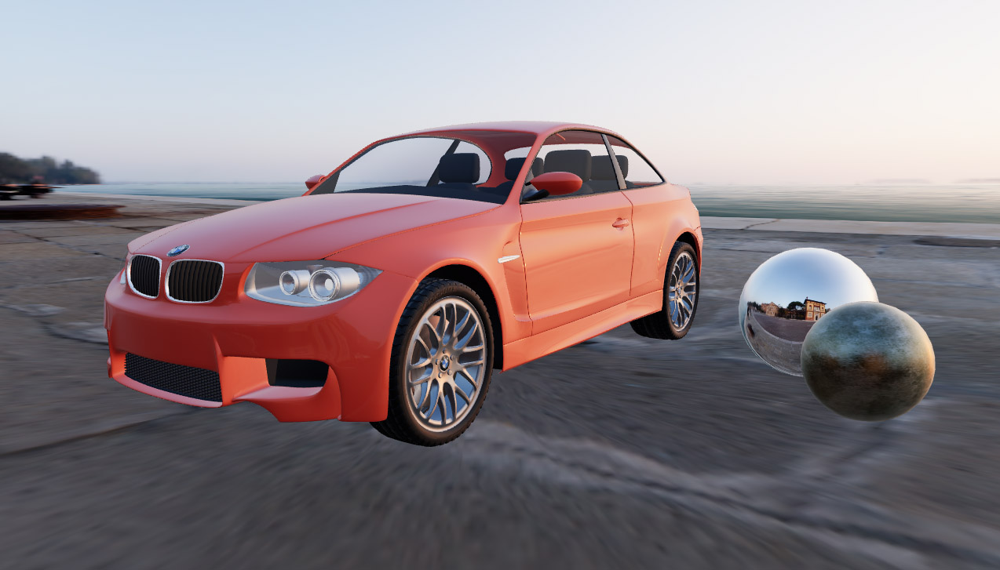

# aframe-hdr-environment-map
An example demonstrating the use of equirectangular hdr maps in A-Frame

[Live Demo](https://mwbeene.github.io/aframe-hdr-environment-map/)

## Parameters

| Parameter   | Default | Description |
|-------------|---------|-------------|
| **url**  | null | File location of equirectangular hdr map |
| **showBackground** | false | Whether or not to display the hdr image as the renderer background |
| **showGround** | false | 'Flattens' the bottom of the environment map to create a floor/ground |
| **groundSize** | 30 | Size of the environment map when showGround is true

## Notes

This component requires the RGBELoader script to be loaded separately, since this is not packaged with A-Frame's version of three.js

## Credits

The car model was created by Mike Pan for the [Blender "Car Demo"](https://www.blender.org/download/demo-files/)

The environment map was created by Greg Zaal and available on [PolyHaven](https://polyhaven.com/a/venice_sunset)

